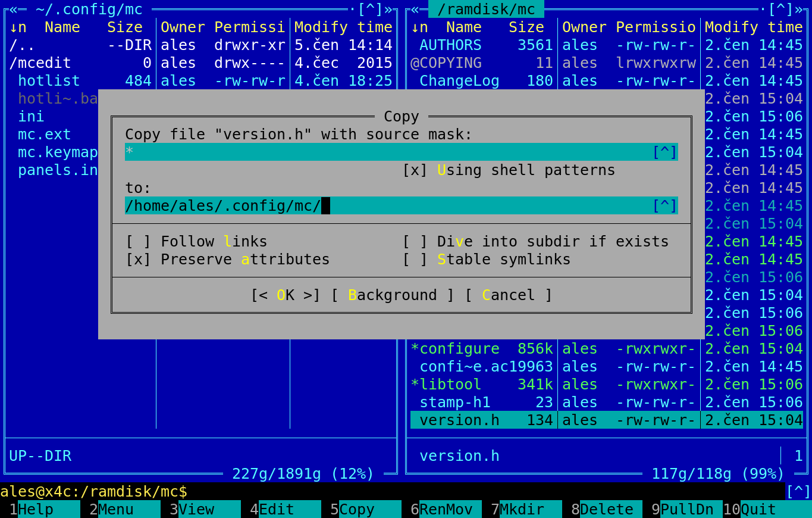

# Retro Midnight Commander skins

## What is here?

Here are the Midnight Commander skins from similar programs for DOS and Windows:

* Norton Commander (for DOS, abandoned)
* Volkov Commander (for DOS, abandoned)
* Far Manager (for Windows, still in development: [FarManager.com](https://www.farmanager.com/))

I tried to make skins as similar as possible but with preserving MC usability. So there are these differences:

* in other commanders, there are no special colors for different file types. Some of the types did not even exist. Skins here keep colors from the Midnight Commander (because of usability). Also, directories have a different color than file for the same reason. You can edit skin if you like to have exactly the same colors but I found this more useful
* originally, there are some special dialogs with special colors (like in `Find File`). Midnight Commander has not a special color scheme for it, so it is the same as the rest
* some of the visual properties is not possible to achieve in Midnight Commander, like a different color of buttons, or dialog padding, dialog shadows or zooming boxes
* I did not change colors of `Diff Viewer`, and only some colors from `Help`. If you would like to improve this, make a pull request :-)

## How to use it?

Download skin `.ini` files to `~/.local/share/mc/skins` (create directory if needed). Then, (re)run Midnight Commander and in menu (`F9`) => `Options` => `Appearance`, new skins will be present. You can choose it. After selecting, don't forget to `Options` => `Save Setup` to preserve this skin in next runs.

In order to have better visual experience, disable `Menubar visible` and `Hintbar visible` in `Options` => `Layout`.

If you want an even more retro look, you can use original font from DOS [Classic Console](http://webdraft.hu/fonts/classic-console/) or [PxPlus IBM VGA8](https://int10h.org/oldschool-pc-fonts/fontlist/). But I don't recommend it, it is not so visually usable nowadays. Or you can make all fonts bolder (by adding `;bold` after color in `[core]` => `_default_`) but I don't recommend it for the same reason either (note that for some reason, this will also change some colors defined by keyword, not by `#rgb` value).

I'm using Volkov Commander skin for everyday use and it is very well usable.

## Screenshots

### Norton Commander skin:

### Volkov Commander skin:

### Far Manager skin:

### Default Midnight Commander skin
For the record, this is the default Midnight Commander skin looks like (without menu and hint bars):

## Contact

If you would have any questions or so, write to me at ales.janda@kyblsoft.cz.
